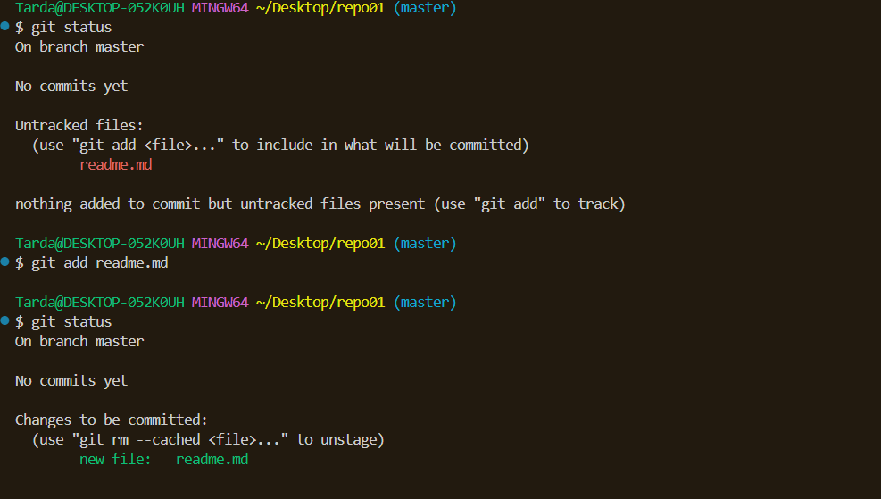

# Ejercicio 1

1.1 Para que un directorio sea considerado un repositorio, hay que indicarselo a Git.

1.2 Al indicarlo mediante el comando git init, se creará un archivo .git dentro de la carpeta que lo distinguirá de un directorio corriente.

1.3 El fichero se encuentra "comitted" dentro de "file status lifecycle"

1.4 No hay ningun repositorio remoto asociado al local

1.7 Despues de crear el repositorio remoto e introducir los comandos para asociarlo al local, ya se encuentra vinculado
1.8 

